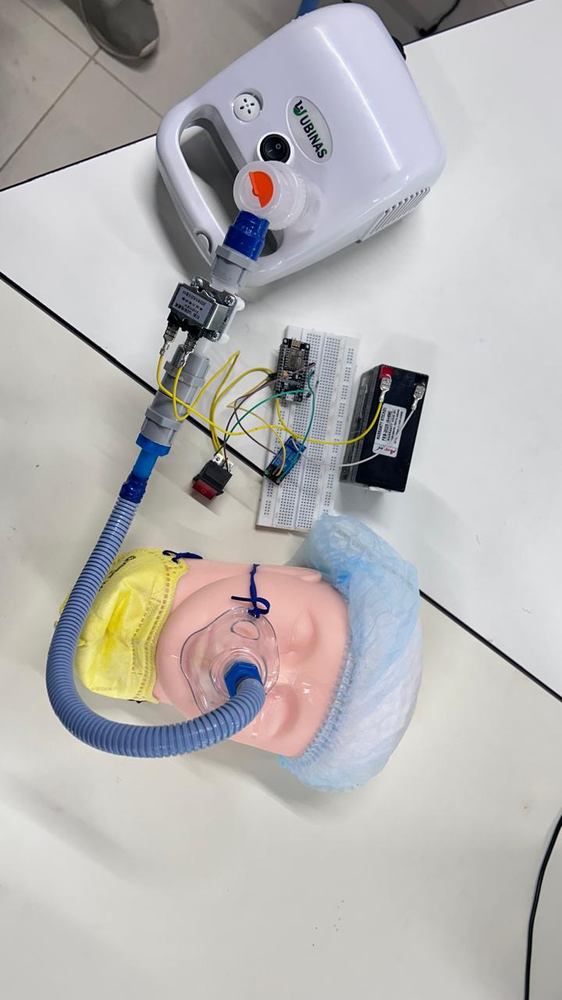
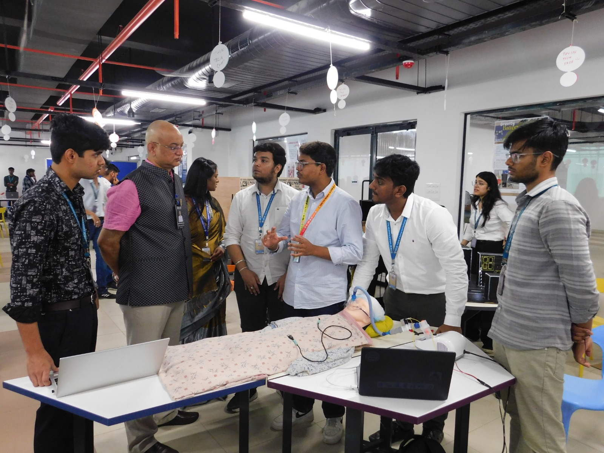

# Ventysync: IoT-Driven Digital Twin for Ventilator Systems

Ventysync is a two-way interactive 3D digital twin of a medical ventilator system. Built in Unity, this project serves as a visual client that bridges virtual UI interactions with real-world physical hardware via REST API state management. 

The system relies on a two-way synchronization loop: user interactions dispatch state-change payloads to the hardware, while a continuous polling client ensures the virtual environment instantly reflects any manual overrides on the physical machine.

## 🛠 Tech Stack & Architecture
* **Engine:** Unity (v6000.0.34f1) / C# 9.0
* **IoT Platform:** ThingSpeak API
* **Networking:** `UnityEngine.Networking` (UnityWebRequest)
* **Data Handling:** `Newtonsoft.Json` (JObject parsing)
* **UI & Physics:** Unity UI Toolkit (`UIDocument`), Procedural Physics (`LineRenderer`), and Rigidbody mechanics

## 📷 System States

### Active State (Hardware ON)
*System sends a `1` payload to the ThingSpeak server, activating physical hardware and virtual particle systems.*


### Inactive State (Hardware OFF)
*System sends a `0` payload, cutting hardware power and updating the digital cylinder state.*


## 🔌 Physical Hardware Integration
The virtual environment communicates directly with a custom-built IoT hardware setup. The physical circuit utilizes a microcontroller and relay system to control the air pump based on the API payloads received from the Unity client.



## 🎤 Live Demonstration
Ventysync was successfully exhibited and demonstrated live as a fully functional IoT Digital Twin at the Twin Tech Expo.



## 📂 Repository Structure
```text
ventysync/
├── Assets/                 # Core Unity assets (C# scripts, 3D models, UI layouts, materials)
├── Packages/               # Unity package dependencies
├── ProjectSettings/        # Unity project configurations (Input, Graphics, Tags, etc.)
├── UIElementsSchema/       # UI Toolkit schema definitions
├── images/                 # Showcase images and hardware photos
├── .gitignore              # Git ignore rules for Unity (excludes Library, Logs, etc.)
└── README.md               # Project documentation
```

## ⚙️ Core Engineering Logic
1.  **Asynchronous Polling:** A C# Coroutine pings the ThingSpeak `feeds.json` endpoint every 2 seconds, parsing the JSON payload to dynamically update the virtual twin's state based on the physical hardware.
2.  **API Dispatch:** User interactions via the UI Toolkit trigger REST requests to the ThingSpeak `update` endpoint, mutating the real-world hardware state.
3.  **Procedural Rendering:** Features physics-based hose simulations utilizing mathematical interpolation (`Mathf.Lerp` / Sine waves) for realistic gravity sagging.
4.  **First-Person Navigation:** A custom physics-based Rigidbody controller handles player movement and rotation, allowing users to smoothly navigate and interact with the 3D medical environment.
5.  **Environmental Animation:** Includes aesthetic 3D medical environment elements (e.g., simulated heart rate monitor) for visual polish.

## 🚀 Setup Instructions
1. Clone the repository: `git clone https://github.com/yourusername/ventysync.git`
2. Open the project folder in Unity Hub (requires version 6000.0.34f1 or newer).
3. Navigate to the API controller script and replace `<YOUR_READ_API_KEY>` and `<YOUR_WRITE_API_KEY>` with your active ThingSpeak credentials.
4. Ensure your local hardware server is powered on and connected to the network to receive API payloads.
5. Hit Play in the Unity editor and press `E` to interact with the environment and initiate the two-way IoT sync.